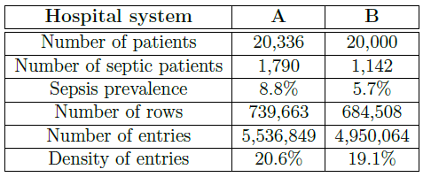
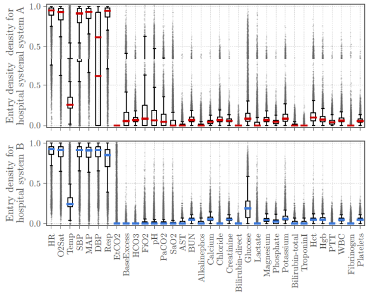
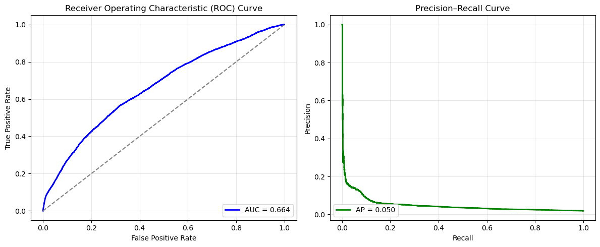

# Early Sepsis Prediction

Team members: [Yang Mo](https://github.com/zetacaveman), [Sayantan Sarkar](https://github.com/Sayantan128), [Cristopher Thompson](), [Alexandria Wheeler](https://github.com/lmwheeler48)

--- NEED LINK to Cristopher's Github page ---

# Table of Contents
1. [Introduction](#introduction)
2. [Exploratory Data Analysis](#exploratory-data-analysis)
3. [Dataset Preprocessing](#dataset-preprocessing)
4. [Baseline Models](#baseline-models)
5. [Deep Learning Models](#deep-learning-models)
6. [Final Model & Results](#final-model--results)
7. [Future Work](#future-work)
8. [Description of Repository](#description-of-repository)

## Introduction

Sepsis is a life-threatening condition that occurs when the body’s response to infection causes tissue damage, organ failure, or death. In the U.S. alone, 1.7 million cases and 350,000 deaths occur each year ([CDC](https://www.cdc.gov/mmwr/volumes/72/wr/mm7234a2.htm)), accounting for $24 billion annually ([Paoli et al., 2018](https://pubmed.ncbi.nlm.nih.gov/30048332/)). Early detection is critical, as each hour of delayed treatment increases mortality by 4–9% ([Seymour et al., 2017](https://pubmed.ncbi.nlm.nih.gov/28528569/)). The goal of this project is to develop a deep learning predictive model to identify sepsis in ICU patients before clinical diagnosis, enabling earlier intervention to reduce mortality, decrease treatment costs, and improve resource allocation.

## Exploratory Data Analysis

The dataset consists of 40,000+ ICU patients' hourly time-series data across 40 clinical variables (vital signs, lab results) and demographics. Each patient was given a label identifying whether or not the patient was later diagnosed with sepsis. An initial EDA revealed three major challenges to address. First, the dataset is severely imbalanced, with only about 7% of patients actually developing sepsis across the two hospitals. Second, the scale of the dataset is massive, with over 1.4 million hourly patient records to work with. And third, there is significant missing data, with only about 20% density across the dataset. 

The dataset density varied by feature, as seen in the figure below. Some features were more dense than others, such as the vital sign data which were typically entered hourly. However, lab results were especially sparse, with some patients having no entries, and others with entries once every few hours. 

Since, this dataset contains a lot of parameters, we conducted a brief literature review to see what factors are key to an ICU sepsis diagnosis. Singer et al. ([2016](https://jamanetwork.com/journals/jama/fullarticle/2492881)) defines sepsis as life-threatening organ dysfunction and septic shock as persistent hypotension (MAP≥65 mmHg) with lactate>2 mmol/L despite fluids. They also introduced qSOFA (fast respiratory rate, altered mental status, low BP) as a quick bedside risk tool. Ryoo & Kim ([2018](https://jeccm.amegroups.org/article/view/4083/html)) find that elevated lactate signals severe cellular stress. Temperature management ([Doman et al., 2023](https://www.frontiersin.org/journals/medicine/articles/10.3389/fmed.2023.1292468/full)) aids screening, but aggressive control hasn’t improved outcome. This means that key parameters to monitor include (but are not limited to) <b>respiration rate, temperature, heart rate, lactate</b>, and <b>mean arterial pressure</b>.

The `EDA_Data_Cleaning.ipynb` notebook explores the clinical time-series data to understand feature behavior and patterns associated with sepsis onset. It examines patient demographics, vital signs, and laboratory trends using statistical summaries and visualizations. The analysis investigates data imbalance between septic and non-septic patients, correlation among variables, and temporal dynamics of critical features like heart rate, blood pressure, lactate levels, and oxygen saturation. Distributions and variability across time and patient outcomes are visualized through histograms, heatmaps, and time-series plots, providing key insights into physiological differences that inform model development and feature importance interpretation.

## Dataset Preprocessing

## 📘 Data Preparation Overview

### 1. Initial Cleaning (`Initial_Data_Processing.ipynb`)
- Loaded the raw ICU dataset and standardized key columns: **patient ID**, **time**, and **Sepsis**.  
- Converted all clinical and time variables to numeric types, handling missing or invalid entries.  
- Sorted records chronologically by **ID** and **time** to ensure temporal consistency.  
- Saved the cleaned dataset in `Output_dir/cleaning_pipeline/` for downstream processing.

---

### 2. Padding and Masking (`EDA_Data_Cleaning.ipynb`)
- Loaded the cleaned dataset and identified all numeric clinical features.  
- Computed the target sequence length using the **95th percentile** of patient record lengths.  
- For each patient, truncated or padded the sequence (keeping the tail) with a padding value of **−1**, added a **Mask** column to mark valid time steps, and built fixed-length sequences for deep learning models.

---

### 3. Exact Stratified Splits (`EDA_Data_Cleaning.ipynb`)
- Derived patient-level labels using the maximum **Sepsis** value per patient.  
- Performed an **exact 60/20/20 stratified split** to create **training**, **validation**, and **testing** sets while maintaining septic/non-septic balance.  
- Ensured no patient overlap across splits.  
- Saved patient lists and split-specific Parquet datasets in `Output_dir/padded_masked/`.

---

✅ **Output Summary**
- Cleaned dataset → `Output_dir/cleaning_pipeline/all_patients_cleaned.csv`  
- Padded + masked dataset → `Output_dir/padded_masked/sepsis_dataset_padded_masked.parquet`  
- Split datasets → `Output_dir/padded_masked/{train,val,test}_patients.csv` and Parquet files

## Baseline Models

We established a logistic regression baseline to benchmark deep learning performance. While quick to train on the large dataset, the model did not achieve high accuracy metrics, with a test AUROC of 66% and low precision and recall scores at 23% and 1% respectively.

At this time, it is clear that this baseline model is insufficient for clinical deployment and further work is needed to address issues impacting performance. We also attempted a K-Nearest Neighbors model with Dynamic Time Warping distance, which is specifically designed to handle time-series data. However, this model was not equipped to handle the scale of the dataset, nor the severe class imbalance. 

## Deep Learning Models

Three deep learning architectures were engineered and their performances compared: <b>GRU-D, TCN</b>, and <b>TRT</b>. 

## 🧠 GRU-D Summary (Gated Recurrent Unit with Decay)

| **Component** | **Mathematical / Functional Description** | **Purpose in Model** |
|:---------------|:------------------------------------------|:---------------------|
| **Input Decay (γₓ)** | $$\gamma_x = e^{-\max(0, W_x \Delta_t + b_x)}$$ | Learns how quickly each input feature's influence fades over time gaps |
| **Hidden Decay (γₕ)** | $$\gamma_h = e^{-\max(0, W_h \Delta_t + b_h)}$$ | Controls how much past hidden states are retained or forgotten |
| **Imputation Rule** | $$x_t' = m_t ⊙ x_t + (1 - m_t) ⊙ (\gamma_x ⊙ x_{t-1}' + (1 - \gamma_x) ⊙ \bar{x})$$ | Fills missing data using past values and feature means |
| **Hidden Update (GRU-D)** | $$h_t = (1 - z_t) ⊙ (\gamma_h ⊙ h_{t-1}) + z_t ⊙ \tilde{h}_t$$ | Combines new information with decayed memory for temporal prediction |
| **Loss Function** | Focal Loss (α = 0.75, γ = 2.0) | Handles class imbalance by emphasizing rare septic cases |

---

## ⚙️ Training & Evaluation Summary

| **Parameter** | **Value / Setting** |
|:----------------|:-------------------|
| **Batch Size** | 16 |
| **Epochs** | 100 |
| **Learning Rate** | 1e-3 |
| **Hidden Units** | 128 |
| **Dropout** | 0.3 |
| **Optimizer** | Adam |
| **Dataset** | 40,000 ICU patients · 40 variables · 7% sepsis rate |

---

## 📊 Performance Metrics

| **Metric** | **Score** | **Interpretation** |
|:------------|:-----------:|:-------------------|
| **AUROC (Record-level)** | **0.91** | Excellent discrimination between septic vs. non-septic time steps |
| **AUROC (Patient-level)** | **0.82** | Strong generalization across patients |
| **AUPRC** | **0.51** | Good precision-recall balance under class imbalance |
| **Balanced Threshold (0.24)** | Precision = 0.53 · Recall = 0.41 | Stable sensitivity-specificity trade-off |
| **High-Recall Mode (≥ 0.90)** | Recall = 0.88 | Detects nearly all high-risk patients for early alerts |

---

### 🩺 At a Glance
**GRU-D** models **temporal decay and missingness** in ICU data, learns from irregular samples,  
and achieves **robust sepsis prediction performance (AUROC 0.82, AUPRC 0.51)** despite severe **class imbalance (7%)**.

## 🧠 TCN: Temporal Convolutional Networks
by contract, use a series of one-dimensional causal convolution layers to ensure that each prediction at time <i>t</i> depends only on current and past inputs, preserving temporal order. These convolutions are organized in residual blocks with dilated convolutions, ReLU activations, and dropout layers to capture both short- and long-term temporal dependencies efficiently. Padding is applied to maintain consistent sequence lengths across layers. The extracted temporal features are then aggregated using global average pooling, producing a fixed-size representation for the final binary classification layer. This architecture combines the interpretability of convolutional models with strong performance on sequential medical data.

## 🧠 TRT: Temporal Residual Transformer 
is designed for binary sepsis classification using variable-length time-series physiological data. The TRT uses an input projection to map features to d_model (64). It employs two transformer encoder blocks, each containing multi-head self-attention (4 heads) and a feed-forward network, stabilized by residual connections. The model handles irregular sequence lengths via padding and a key padding mask during attention, ensuring padding tokens are ignored. Sequence features are aggregated using masked average pooling before the final binary classification layer. 

The data pipeline segments raw data into patient segments, labeled based on the maximum SepsisLabel. Specific features are excluded, for example EtCO2. Missing values that are labeled as NaNs are replaced with 0.0. The setup checks for PatientID overlap to prevent data leakage. Training addresses class imbalance using class weights applied to the Cross-Entropy Loss. The Adam optimizer is used, and the evaluation relies on AUROC and AUPRC.

## Final Model & Results

Ultimately, we selected the <b>Temporal Residual Transformer</b> (TRT) as our final model due to its strong overall performance. The model produced an overall test accuracy of 83.5% and a test loss of 0.44, indicating stable generalization to unseen data. With regard to class-specific metrics, the TRT achieved a recall (sensitivity) of 76% and a precision of 27%, showing that while the model effectively identifies positive cases, there is room to reduce false positives. Importantly, the model attained an <b>AUROC of 88%</b> and an <b>average precision (AUPRC) of 55%</b>, highlighting strong discriminative ability and robust performance on an imbalanced dataset.

## Future Work

Future work on this project could focus on improving the model to predict not only whether a patient will develop sepsis, but also the specific hour at which onset occurs. Additionally, comparing results between hospitals A and B could help identify potential differences in outcomes; if such differences exist, examining the clinical practices at each hospital may provide valuable insights. Another area of improvement involves refining the model's weights so that it places greater emphasis on parameters most strongly correlated with sepsis. Finally, continued efforts to enhance the overall accuracy of the model will always be beneficial.

## Description of Repository
